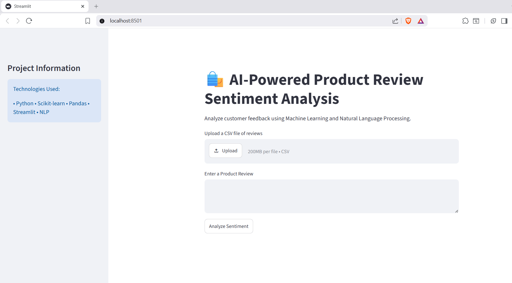

# AI-Powered Product Review Sentiment Analysis

## Overview

A web-based sentiment analysis application that classifies customer product reviews as Positive, Negative, or Neutral using Machine Learning and Natural Language Processing (NLP).

## Features

* Sentiment prediction for individual reviews
* CSV file upload support
* Positive, Negative, and Neutral classification
* Sentiment summary visualization
* Interactive Streamlit web interface

## Technologies Used

* Python
* Streamlit
* Pandas
* Scikit-learn
* NLP (TF-IDF Vectorization)
* Naive Bayes

## Project Structure

Sentiment-Product-Review-Analysis

├── app.py

├── reviews.csv

├── sample_reviews.csv

├── requirements.txt

└── README.md

## How to Run

1. Install dependencies:

pip install -r requirements.txt

2. Run the application:

streamlit run app.py

## Future Enhancements

* Larger review dataset
* Improved model accuracy
* Sentiment confidence scores
* Word cloud visualization
* Advanced analytics dashboard

## Screenshots

### Home Page

### Sentiment Analysis Results

## Author

Sakshi Pandey
